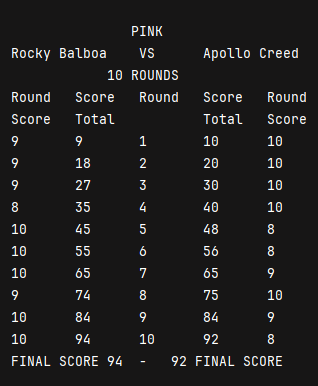

# Bruno's Boxing
Basado en [Bruno's Boxing de dfleta](https://github.com/dfleta/frank-brunos-boxing-examen), programado durante 1º Desarrollo de Aplicaciones Multiplataforma.

El programa simula la lectura de tarjetas de puntuación de boxeo por tres jueces, lanzando por consola un resultado visual que imita la estructura de una tarjeta real. 

